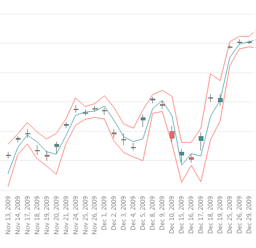

# Candlestick for Power BI

Candlestick by OKViz is used to describe price movements of a security, derivative, or currency. Each candle in the chart typically shows four price values: high, low, open, and close. This visual allows you to define multiple trend lines for analysis purposes, such as the Bollinger Bands.

Find out more on http://okviz.com/candlestick/

### Copyrights

Copyright (c) 2016-2017 OKViz - trademark of SQLBI Corp.

See the [LICENSE](/LICENSE) file for license rights and limitations (MIT).